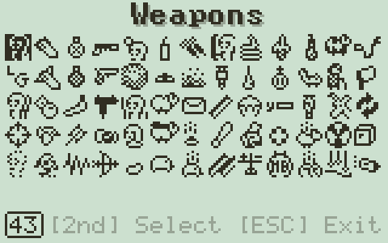

# Intro Blurb

I started this project over 20 years ago, though, it hasn't been in development the entire time. While I have finally finished and published it, I still learned many things a long the way and am proud of the solutions I came up with. Check the side bar to the left to skip to sections you find interesting, or keep scrolling to appreciate the full story. If nothing else, I recommend looking at the weapons system - I'm really proud of that work.

# Project History

In 2004 I was a young programmer, and I cut my teeth with TI-basic and C on graphing calculators. At the time, the Worms franchise was popular and I would often play with my friends. In the car pool in the morning, or on the bus home I often played a worms port by [Jean-Christophe Budin](https://www.calculatorti.com/ti-games/ti-89/asm/worms-89/). I decided to test out my C skills, and program my own version - a full clone of Worms World Party, the newest game in the series at the time.

I got many features built, but I hit the 65k limit and ran out of space. Nevertheless, I published what I had anyway on my personal site.

Screens captured from the original build:


In 2017, [Lionel Debroux](https://www.cemetech.net/users/Lionel%20Debroux) found my post and reached out to me with some optimizations he found in my code, saving up to 6k bytes, and suggested I might be able to finish. I looked at my atrocious code from 2004, and with an extra 13 years of experience, I decided I could just do a scratch rewrite in a few weeks.

I ended up building a rock-solid foundation, but it had 1 bug that stumped me: moving the camera would cause a crash. At the same time, my renewed interest in low-level C programming led me to learn how to write GameBoy/Color, GameGear/SMS, and SegaGenesis roms. I ultimately got distracted, burned out, and demoralized from the camera bug.

Recently I've been using AI a lot as a coding utility, specifically Gemini, and it's been great. Something reminded me of the 2017 remake, and I decided to see if AI could find the bug. It did. In like 30 seconds, lol.

I decided to read my 2017 code base, and it was perfect. After I wrapped up my holiday projects this past December, I decided to put some time in on this project, to see how much further I could take it.

I added tons of stuff and promptly ran out of space again, so I dusted off my 9-year-old email thread with Lionel, and he replied! He then found me like 10k more bytes to work with.

I sprinted towards the end and managed to not only finish, but add even more features than I had originally intended.


# The State Machine

My first order of business was to make a state machine to break the game into manageable pieces and compartmentalize the logic to avoid spaghetti code.

The game has the following states:

- **PlaceWorms** - If enabled in settings, before a round players can place their worms on the map
- **WormSelect** - When the turn starts, players can optionally pick a worm to use
- **Turn** - The actually playable interactive portion of a turn
- **WeaponSelect** - Shows the weapon select menu, clock still running.
- **Pause** - Shows the pause menu, stops the clock.
- **Cursor** - some weapons, like Air Strikes or Homing Missile require a cursor to place a target
- **TurnEnd** - after user has used their weapon or taken damage, TurnEnd runs until all the 'action' has settled down (physics items at rest, all weapons cycles done, etc)
- **Death** - after the turn is over, the worms with 0 health take turns blowing up. This can cause more action from chain reactions, so this also waits for everything to settle
- **AfterTurn** - does things like spawn health creates, raises water during sudden death, etc
- **GameOver** - If AfterTurn detects a team one, or both were eliminated, this state shows the match results.

Below is a full graph of the state machine:


Each state got it's own `.c` and `.h` file to compile, and each provided these mandatory methods:

```c
/**
	Called on the first-frame when the Games state machine is set to WormSelect mode.
*/
static void WormSelect_enter()
{
	// ...
}

/**
	Called every frame that the Games state machine is in WormSelect mode.
*/
static void WormSelect_update()
{
	// ...
}

/**
	Called on the first-frame when the Games state machine leaves WormSelect mode.
*/
static void WormSelect_exit()
{
	// ...
}
```

This allowed me to have life-cycle methods for every state, so I could do init, clean up, and of course frame-update logic in clean easy to find places. The main state machine in `Game.c` simply calls these methods with a large switch to make sure they always run in the `CurrentState_exit`, `NextState_enter`, and now `CurrentState_update` order.

# My First Mistake - OOPifying my Code

At the time I began the remake in 2017, I was a full time Unity programmer using C#. Once you start thinking in OOP, it can be hard to break out of that mindset. I was programming in the `GCC4TI` environment, which is C only - and C doesn't have classes.

My gut instinct was to try to do something like:

```c
#include <stdio.h>

// use a struct to package everything in a class-like way
typedef struct SomeClass {

	// define "member variables"
	unsigned short someMemberVariable;
	
	// define methods via function pointer
	void (*someMethod)(struct SomeClass *self, short x);

} SomeClass;

// pass self in because we won't have 'this'
void someMethod(SomeClass *self, short x){

	self->someMemberVariable = x;
}

// Then we pretend we have constructors with the 'new' keyword
SomeClass new_SomeClass(unsigned short initialValue){
	
	SomeClass newInstance; 
	newInstance.someMemberVariable = initialValue;
	
	// assign method to function pointer
	newInstance.someMethod = &someMethod;

	return newInstance;
}

int main() {

	// Then we can approximate classes in C:
	SomeClass someInstance = new_SomeClass(10);

	// prints "Member value: 10"
	printf("Member value: %d\n", someInstance.someMemberVariable);

	// Call method, passing in struct ref so it has 'self'
	someInstance.someMethod(&someInstance, 20);

	// prints "Member value: 20"
	printf("Member value: %d\n", someInstance.someMemberVariable);
	
	return 0;
}
```

I was happy with my makeshift `class` solution and started knocking out some code. Until I noticed my build size was inflating dangerously rapidly. I soon realized that this pattern was a memory hog and bloated up the final executable.

Luckily I wasn't in too deep and was able to reverse course before I gave up again.

# Rethinking OOP

I needed a new approach, so I decided to use C modules as they were intended. With a combination of c and header files, I would prefix all the exported (`extern`ed) variables and methods with a prefix, like 

- `Worm_x` array of worm's x positions
- `Worm_y` array of worm's y positions
- `void Worm_spawnWorm(short index);`
- `extern void Worm_setHealth(short index, short health, char additive);`

This way, as the code-base grew, I could immediately know which file to look for definitions in. In this case, `Worm.c` and `Worm.h`.

Because of the module scoping, I could declare methods and members in the file scope and those wouldn't use the prefix.

In the end, this wasn't too much worse to follow, but you'll notice I used separate arrays for `Worm_x` and `Worm_y`.

# Arrays-of-Structures (AoS) vs Structure-of-Arrays (SoA)

This might be a controversial decision, and maybe I over-corrected from my previous experience with `struct`s, but I decided to use a pattern known as "Structure-of-Arrays".

When you first learn programming, you are taught to group data logically. If you have a Worm, you create a struct containing its X, Y, Health, and Velocity, and then you make an array of those structs. This is called an Array of Structures (AoS).

But hardware doesn't think logically; it thinks linearly. When a CPU loads a chunk of memory into its cache, it grabs a sequential block. If you are looping through every worm just to update their X positions, an AoS forces the CPU to load the Health, Velocity, and Animation states into cache as well, wasting precious space and causing agonizingly slow "cache misses."

Worms89 abandons standard OOP principles in favor of Data-Oriented Design, specifically a Structure of Arrays (SoA) pattern. The concept of a "Worm" as a contiguous object in memory doesn't exist. Instead, the game maintains parallel arrays of individual properties.

```c
// Worms.h - Notice how data is separated by property, not by entity
#define MAX_WORMS 16

extern short Worm_x[MAX_WORMS];
extern short Worm_y[MAX_WORMS];
extern char  Worm_xVelo[MAX_WORMS];
extern char  Worm_yVelo[MAX_WORMS];
extern short Worm_health[MAX_WORMS];
extern char  Worm_mode[MAX_WORMS];
```

While I would never write code like this in a modern application, this tends to be more efficient on constrained platforms like a calculator. The values are aligned in memory, and doesn't end up using padding or having to compute offsets for an array of structs.

Either way, this is the pattern that took the app to completion.

# Making a Map

The previous existing version of Worms for TI-89 by Jean-Christophe Budin used a 1-dimensionally height map for the map. That is, an array of 'heights' and the map was drawn as a serries of lines from the bottom of the screen to their height. This allowed for explosions to carve _pits_ in the map, but it was limited. You couldn't have concavity or tunnels.

My first attempt to was to define some huge memory buffers, where each bit in every byte corresponded to land. `0 = no land` `1 = land`. This worked, but was surprisingly slow. 

But then I remembered I was using [ExtGraph](https://github.com/debrouxl/ExtGraph) - an excellent library for doing graphics work in GCC4TI or Assembly. The library allows you to define arrays of `unsigned char`s, `unsigned short`s, or `unsigned long`s. You could then call methods like `ClipSprite32_OR_R` to draw the data to the screen buffers super fast.

I realized I didn't have to do the memory work myself - I could just make large 32-pixel wide buffers of `unsigned long`s. I could have as many vertical slices as tall as I wanted. Because it just takes in a pointer to the array, I could use pointer arithmetic to offset the start of the buffer to account for vertical scrolling. Because the method `ClipSprite32_OR_R` automatically clips the sprite to valid memory addresses, I didn't need to implement that math myself.

The TI-89's screen is 160 pixels wide, which can be drawn completely with 5 vertical slices of 32 pixels each, but if the map is partially scrolled horizontally, there may need to be a 6th draw call.

This was lightning fast - but also gave me a bonus feature: textured maps.

The ExtGraph library allows you to have gray-scale graphics. It defines two buffers "Light" and "Dark", and flickers them rapidly in something like a 1/2 and 2/3 ratio. The Dark buffer is written to the screen about two-thirds of the time, while the light buffer is only one third.

This causes the lazy pixels int he display to not fully blacken, by turning them off at different intervals. You can have black pixels by writing to _both_ buffers, so those never turn off. You can have white pixels by drawing to _neither_ (or setting 0's). You can have light or dark pixels by only writing 1's to their respective buffers.

Because I was able to draw the map in 6 sprite calls, I could draw a full gray-scale map in just 12 draw calls and it still scrolled lighting fast!

The final game has a playable map 4 times the calculators resolution: 320x200.

Below is a recording of the map just after I got the super fast sprite system working when I was still using placeholders for map items, and after that is shortly after I finalized the textured map and started getting real items


Speaking of adding objects ...

# Revisiting Structs for Physics

With the map out of the way, I needed to get stuff living on it. I started with Worms and Crates, but I quickly realized I didn't want to re-implement physics for a bunch of different systems.

The game has a number of in game objects:
- **Worms** - obviously the worms themselves
- **Crates** - Weapon, Tool, or Health crates that drop from the sky
- **Oil Drums** - Spawned on the map at start, highly explosive
- **Landmines** - Spawned on start, or placed by other Worms, they need physics to bounce and roll around
- **Weapons** - Most of the weapons need Physics in some way or another

I decided to selectively re-visit structs for my physics system.

Because the game uses the SoA (Structure of Arrays) pattern, entities like Worms, Weapons, and Crates have their data spread across global arrays. This presents a massive challenge for writing a universal physics engine. How do you write a generic Physics_apply() function if a Worm's X position is in Worm_x and a Weapon's X position is in Weapon_x?

The game defines a PhysObj struct that acts as a universal adapter. It doesn't hold the data itself; it holds pointers to where the data lives in the global arrays.

```c
typedef struct {
    // Pointers to the actual variables!
    short *x, *y;
    char  *xVelo, *yVelo;
    
    float bouncinessX, bouncinessY;
    char  smoothness;
    char  staticFrames;
    unsigned short *settled; // Pointer to bitwise settlement flag
    
    Collider col; // The shape of the collision box
} PhysObj;
```

When a weapon is spawned, the game wires up the puppet strings:

```c
// Hooking the universal physics object to the specific weapon's memory
new_PhysObj(&Weapon_physObj[slot], 
            &Weapon_x[slot], 
            &Weapon_y[slot], 
            &Weapon_xVelo[slot], 
            &Weapon_yVelo[slot], 
            70, 100, slot, &Weapon_settled);
```

Now, the physics engine can blindly process PhysObj structs. When the physics engine updates *(obj->x) += *(obj->xVelo), it is secretly updating the global Weapon_x or Worm_x array directly. This way the physics system doesn't need to know what kind of object it's computing for. It can just run the logic agnostic of the item it's attached to. This allows the complex logic of bouncing, friction, wind, and map-collision to be written exactly once and applied uniformly to everything from an exploding sheep to an oil drum.

# The Mix-In Weapon System: A Symphony of Bits

The game was based on Worms World Party which provides 65 weapons/tools available to the player. My plan was to implement them all:



But there are also hidden weapons, such as fire particles or carpets that spawn from the carpet bomb. Overall, I ended up implementing 77 unique weapons that all needed logic and graphics.

Worms68k Party uses a Bitwise Flag System. Think of it like a custom pizza menu. Rather than having a separate recipe for every single combination of toppings, you start with a base dough (a weapon entity) and simply check off the toppings you want. Does it use physics? Does it need a crosshair? Does it explode on impact? By defining a series of binary flags, a weapon's entire behavioral identity is compressed into a single 32-bit integer.

```c
// Define bitmask flags for the types of properties a weapon can have:
// when spawning a weapon, these can be ORed together to create its logic
#define usesAim                 0b00000000000000000000000000000001
#define usesCharge              0b00000000000000000000000000000010
#define usesCursor              0b00000000000000000000000000000100
#define usesPhysics             0b00000000000000000000000000001000
#define usesWind                0b00000000000000000000000000010000
#define usesHoming              0b00000000000000000000000000100000
#define usesFuse                0b00000000000000000000000001000000
#define usesDetonateOnImpact    0b00000000000000000000001000000000
#define isCluster               0b00000000000000000000100000000000
// ... and many more
```

Here are some highlights:
- `usesAim` - this weapon will show the crosshair when the user activates it and enable the input buttons for aiming and firing.
- `usesCharge` - paired with the previous flag, some aimable weapons don't charge, like Ninja Rope, while others like Bazooka do.
- `usesPhysics` - tells this weapons `update()` method to do the physics routines on it's position/velocity variables.


If you wish to see the full list with descriptions expand this box:
```c
// Define bitmask flags for the types of properties a weapon can have:
// when spawning a weapon, these can be ORed together to create it's logic
#define usesAim 				0b00000000000000000000000000000001	// true if this weapon needs to be aimable
#define usesCharge 				0b00000000000000000000000000000010	// true if this weapon also charges while firing
#define usesCursor 				0b00000000000000000000000000000100	// true if requires the cursor to pick an x/y location before firing
#define usesPhysics 			0b00000000000000000000000000001000	// true if the weapon object that is spawned will use physics system
#define usesWind 				0b00000000000000000000000000010000	// true if the weapon should be affected by wind physics
#define usesHoming 				0b00000000000000000000000000100000	// true if weapon object that is spawned needs homing functionality in it's update loop
#define usesFuse 				0b00000000000000000000000001000000	// true if the weapon object that is spawned has a fuse timer logic
#define usesDetonation 			0b00000000000000000000000010000000	// true if the weapon object that is spawned can be de
#define usesController 			0b00000000000000000000000100000000	// true if inputs (i.e. 2nd, or Up/Down/Left/Right) may affect the weapon's uupdate logic
#define usesDetonateOnImpact 	0b00000000000000000000001000000000	// true if it should explode when touching land
#define isAnimal 				0b00000000000000000000010000000000	// true if it has animal update logic
#define isCluster 				0b00000000000000000000100000000000	// true if it needs to spawn other items when it detonates
#define isParticle 				0b00000000000000000001000000000000	// true if it's a object that has alternate physics (particular routine)
#define isMele 					0b00000000000000000010000000000000	// true if it's a mele-type weapon
#define spawnsSelf 				0b00000000000000000100000000000000	// true if the weapon object that is spawned should use the same sprite as it is in the menu
#define multiUse 				0b00000000000000001000000000000000	// true if the weapon doesn't end turn
#define usesRaycast				0b00000000000000010000000000000000	// true if the requires firing uses raycasting instead of spawning objects
#define holdsSelf				0b00000000000000100000000000000000	// true if the weapon should use it's menu sprite in the worms hand
#define holdsLauncher			0b00000000000001000000000000000000	// true if the weapon should use the generic rocket launcher when equipped
#define holdsCustom				0b00000000000010000000000000000000  // true if there needs to be custom switch logic for what the worm should hold
#define usesAirStrike			0b00000000000100000000000000000000  // weapons that spawn groups of things in the sky
#define usesRoutine 			0b00000000001000000000000000000000  // true if the weapon needs custom per-frame logic	
#define isMeta 					0b00000000010000000000000000000000  // if weapon is meta (affects the round / game state)	
#define isDroppable 			0b00000000100000000000000000000000  // true if its droppable (dynamite, mines, ming vase, etc)	
#define usesConstantGravity 	0b00000001000000000000000000000000  // true if weapon is affected by constant gravity (e.g. longbow, magic bullet, etc)
#define usesJumping 			0b00000010000000000000000000000000  // true if animal jumps
#define doesntEndTurn			0b00000100000000000000000000000000  // true if weapon doesn't end turn when used
#define noRender				0b00001000000000000000000000000000  // true if weapon object shouldn't be rendered (e.g. weapons that spawn just to run a routine)
#define customRender			0b00010000000000000000000000000000  // true if weapon object needs custom case to render itself
#define usesPreAim				0b00100000000000000000000000000000  // added for NinjaRope - user should be able to aim before applying the rope
```

With these building blocks defined, the "master list" of weapons becomes a beautifully concise array. The game simply queries this array during the update loop. If a weapon's integer has the `usesWind` bit flipped on, the wind system gently nudges its X-velocity. If `usesFuse` is active, a timer ticks down.

```c
unsigned long Weapon_props[77] = {

    // Jet Pack (A "meta" tool that doesn't consume your turn)
    isMeta | doesntEndTurn,

    // Bazooka (Affected by physics, wind, explodes instantly)
    usesAim | usesCharge | usesPhysics | usesWind | usesDetonateOnImpact | holdsLauncher,

    // Grenade (Bounces around, uses a fuse timer)
    usesAim | usesCharge | usesPhysics | usesFuse | holdsSelf | spawnsSelf,

    // Dynamite (Drops at your feet, physics, timer)
    spawnsSelf | usesPhysics | holdsSelf | isDroppable | usesFuse,
};
```

This system, akin to modern Entity Component Systems (ECS), keeps the central game loop incredibly lean. The processor isn't bogged down by virtual method tables or complex inheritance trees; it's just zipping through rapid bitwise AND operations (&). It is a perfect marriage of high-level conceptual design and low-level hardware optimization.

# Controller-Type Weapons

After implementing all the basic weapons, some of the more advanced weapons needed a bit of extra logic. I added the `usesRoutine` flag. Any weapon that had this flag would allow an extra function to run code in it's update loop.

A weapon such as Armageddon actually spawns an invisible `ArmageddonController` weapon. Here's it's definition:

```c
usesRoutine | holdsCustom | usesFuse | noRender,
```
- `usesRoutine` - custom code will run every frame as long as this weapon is active
- `holdsCustom` - a custom sprite is used to draw the weapon in the worms hand
- `usesFuse` - the timer code will be active for this weapon's updates
- `noRender` - don't draw anything for the weapon once it's placed

That last one might be confusing, but essentially we're using the weapon system to place an invisible "empty" weapon entity into the scene that's only job is to run code. It doesn't need a sprite on screen once placed, it just needs to have it's `update` code execute.

When it's `usesRoutine` branch runs, it does as follows:

```c
case WArmageddon:
{
    cameraAutoFocus = FALSE;
    static short focusIndex = 0;

    // The ghost weapon lives for 90 frames. 
    // Every 7 frames, it gives birth to a Comet.
    if(Weapon_time[index] % 7 == 0)
    {
        // 1. Pick a random spot high in the sky
        short spawnX = random(320);
        short spawnY = -50;

        // 2. Calculate a fiery downward trajectory
        char veloX = (random(7) - 3);
        char veloY = 5;

        // 3. Spawn the actual Comet projectile
        short cometIndex = Weapons_spawn(WComet, spawnX, spawnY, veloX, veloY, 90);

        // 4. Cinematic Camera Flair: Track every third comet falling
        if(((Weapon_time[index] / 7) % 3) == 0)
            focusIndex = cometIndex;

        Camera_focusOn(&Weapon_x[focusIndex], &Weapon_y[focusIndex]);
    }

    // When the ghost weapon's timer dies, return control to the game
    if(Weapon_time[index] <= 1)
        cameraAutoFocus = TRUE;
}
break;
```

By reusing the existing weapon update loop for a purely logical controller, the game avoids introducing fragile global states or custom cinematic loops. The weapon system is robust enough to act as an event sequencer. Is it a hack? Yea kinda maybe. But it allowed me to save space in the rom by leveraging the existing systems I had built.

# When is the action over?

Another tricky bit of logic to get right was knowing when to change states from `TurnEnd`->`Death`->`AfterTurn`.

The state machine can just change based on user input - there's a number of systems simulating things, from weapons flying/bouncing around, Worms being blasted into the air, Crates gently landing from the sky, etc.

For all the various entity systems, there's a max of 16 able to spawn at one time. So, a max of 8 worms on each time for 16 in game total. Or a total of 16 crates spawned, 16 mines, etc.

This allowed me to use a single `unsigned short` for the active status of each;

```c

// no worms active by default
unsigned short Worm_active = 0b00000000;

// some code happens ...

// we want to check if worm with index 5 is active:
char wormIndex = 5;
const char isActive = Worm_active & ( (unsigned short)1 << (wormIndex) );

```

I also had some other 16-bit variables, like `_settled` that the physics engine writes to if it hasn't moved an object in several frames.

Because I used the same unsigned 16 bit value for all entity systems in the game, I was able to quickly check if any system had active entities on screen. The state machine just calls this at the end of each frame in `TurnEnd`, `Death`, and `AfterTurn`. If it returned a non-zero value, something somewhere must still be active. If the coast is clear, the state machine will have the green light to transition to the next state.

```c
// if this value is NOT 0, something somewhere is active, exploding, or is a triggered mine
// also note, we don't count fire particles in active state, as they can last more than one turn
unsigned short unsettled =
	(Crate_active & (~Crate_settled))
	|
	(Worm_active & (~Worm_settled))
	|
	(OilDrum_active & (~OilDrum_settled))
	|
	(Mine_active & (~Mine_settled))
	|
	((Weapon_active & ~Weapon_isFire)>0)
	|
	Explosion_active | Mine_triggered;
```

# The Final Challenge: the 64K limit

Due to how the TI-89 pages memory, you can't really write a single executable bigger than 64kb.

When I gave up originally in 2004, I had hit that ceiling long before the game was anywhere near complete. In 2017 when Lionel Debroux reached out to me, he had used compiler optimizations on my original code base to find an extra 6K. While I abandoned that code base, the game would still need a lot more to finish, and that old code was atrocious.

Half of developing for such a constrained environment is knowing how the hardware works, how the compiler works, and writing code in a deliberate way to not generate bloat. I'm still not great at it myself, but I certainly picked up a few things and became hyper memory aware.

As this project was nearing completion - I hit the wall again. I dusted off the decade old thread with Lionel, and he quickly found me 10k more bytes to work with! This time that _was_ enough to finish the Game.

Well, the _Game Engine_.

At this point I hadn't touched the UI at all - the part of the game where you can set up matches, configure teams, and etc.

The game was complete, but as I started adding states to the state machine for `MainMenu`, `TeamsMenu`, etc, I quickly hit the ceiling again.

I decided to take a slightly unorthodox approach, but it works. I split the game in 2 compiled executables:
- `wgame` - this is the game engine that plays the game, and what we've discussed thus far
- `wmenu` - this is an entirely separate code base for the menu system.

But how to glue them together? It's not easy to launch one executable from within another. So I decided to use `TI-Basic` as duct-tape.

Below is `worms68k.89p`:
```tibasic
Prgm

 © Loop until exit code
 Loop

  © Run main menu app
  wmenu()

  © Break if exit code 1
  If wormrun="1" Then
   Exit
  EndIf

  © Run main game engine
  wgame()

 EndLoop

EndPrgm
```

It simply runs the two binary executables back to back in a while loop.
- The basic program first launches the `wmenu` with the title screen and settings
- When the user starts a game, that app:
  - saves the game settings to a binary data file
  - writes `0` to a variable `wormrun`
  - exits completely, freeing all the RAM it occupied
- The TI-Basic while loop skips the `Exit` and proceeds to run `wgame`
- When the game is exited or is over, it exits completely
- The loop returns to the `wmenu` where the user can set up another game, or exit, which writes `1` to `wormrun` so the TI-Basic can exit

Is it elegant? No, not really - there's a quick flash of the calculator home screen between transitions from `wmenu` to `wgame` and visa-versa. But it allowed me to maintain my sanity and have two clean code bases for each half the app.

Plus, the flash of the home screen is kinda charming in a retro-aesthetic sort of way. Like old DOS games that would flash the console between states.

# Final Thoughts

Well, I hope you found this interesting and maybe enjoyed playing the game. I'm glad I decided to pick up this 20 year old project and revisit C on calculators once again. It was very nostalgic to return to a head space from highschool. I even brought out some of the music I used to listen to then, to fully immerse myself in the time travel.

I probably won't be writing any more calculator games anytime soon. But when I revisited this project in 2017, it did something important I mentioned earlier: it inspired me to learn how to use C to program Game Boy games. I eventually went on to learn Game Gear, Master System, and Sega Genesis, having written ROMs for those. I also got compilers working for SNES, and even ran some custom code on N64 and Nintendo DS.

In the future, I almost certainly will be making a game for SNES or DS!

After working professionally in C# land and JavaScript land for the past decade, it's always refreshing to return to the bare metal and work close to hardware. I may even attempt to write a NES game in pure 6502 assembly - it's been on my mind lately.